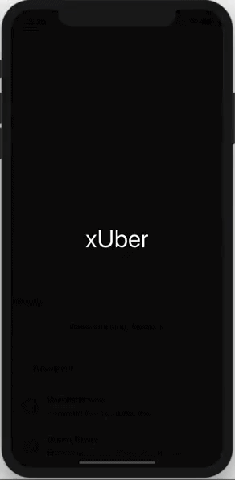
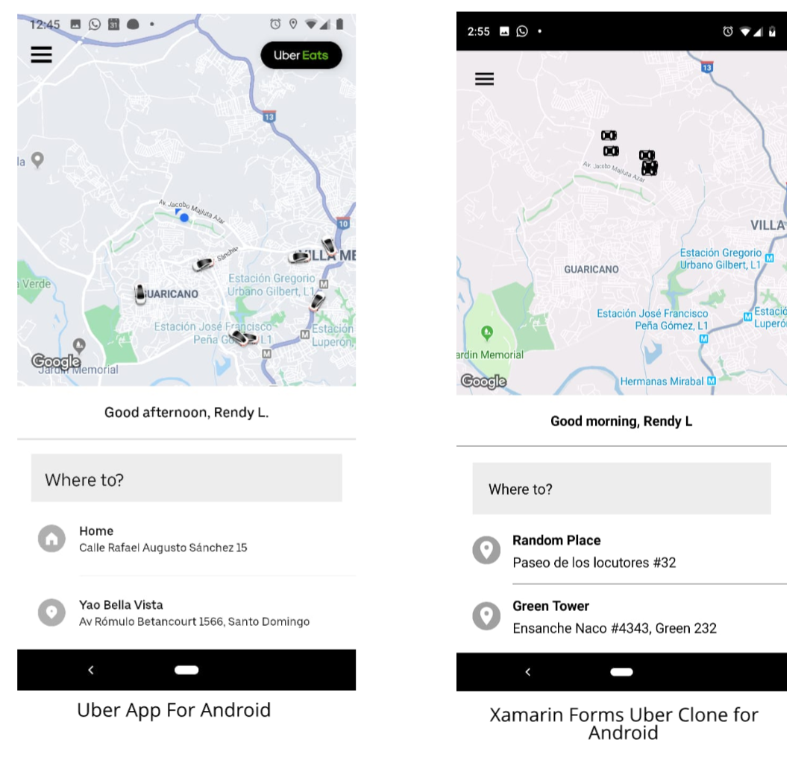
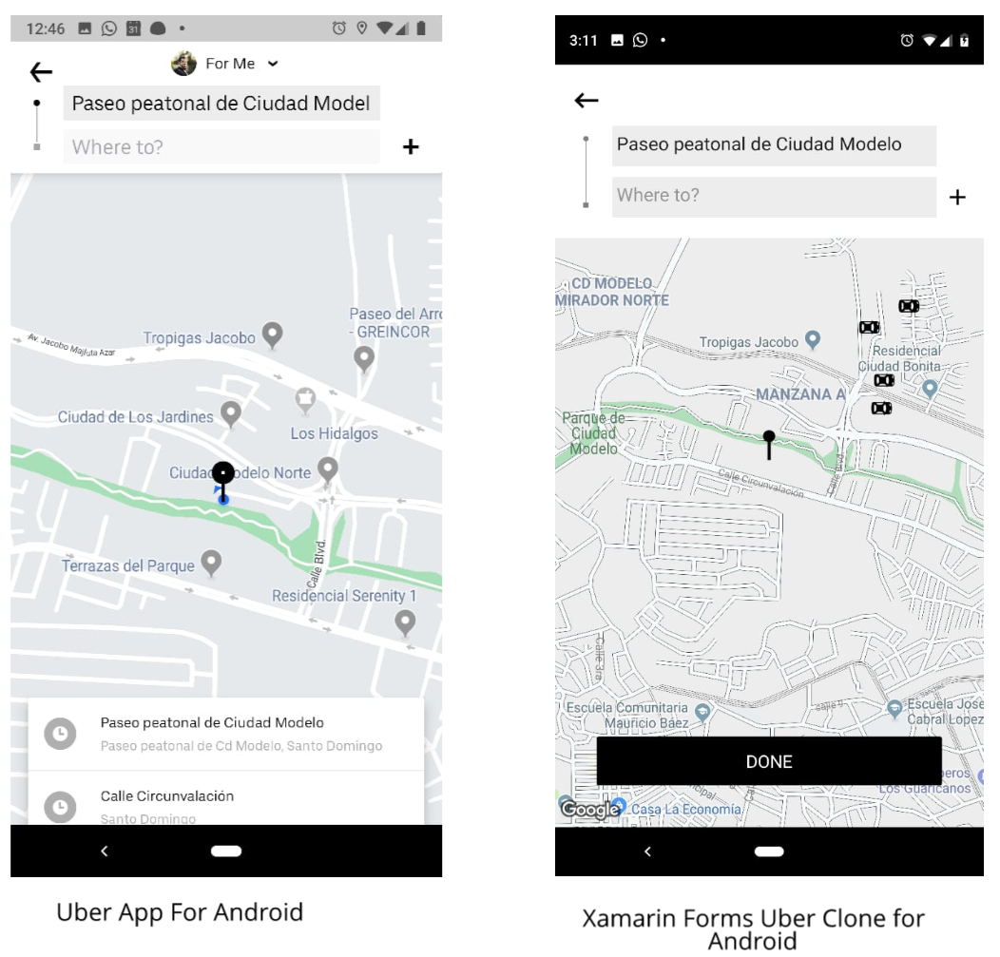
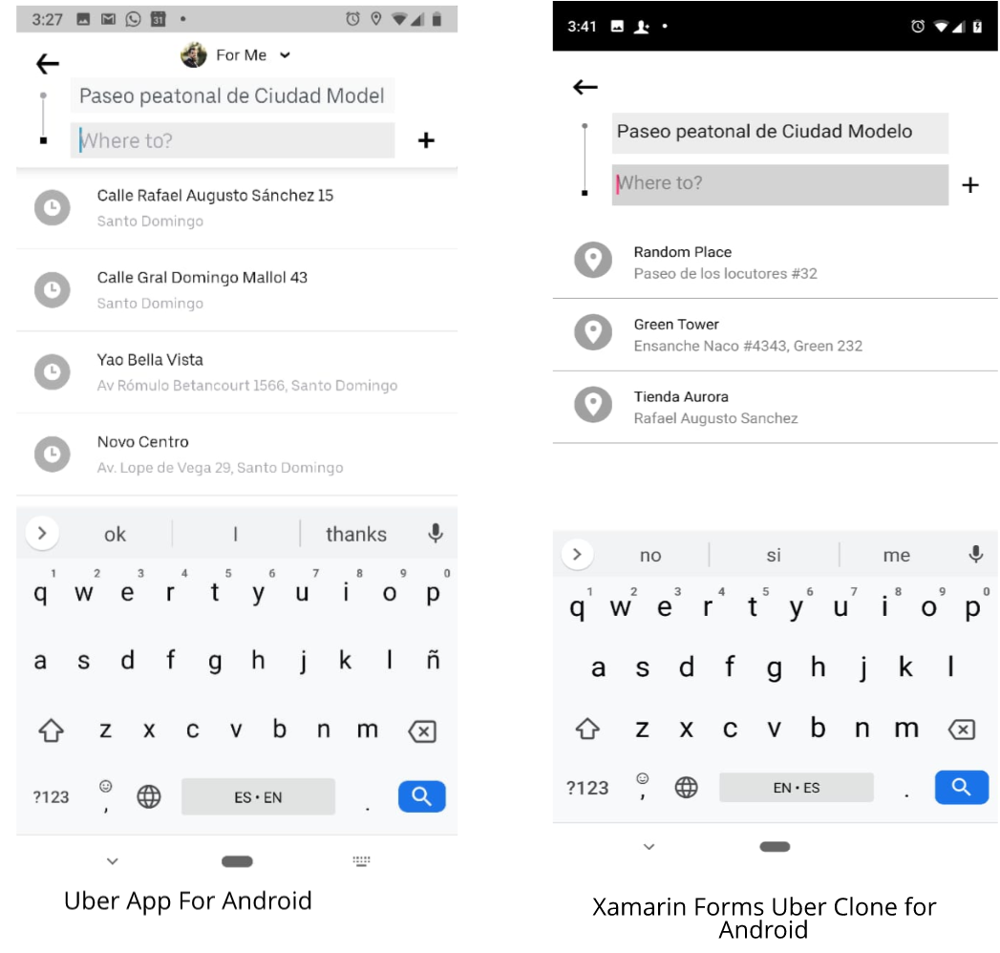
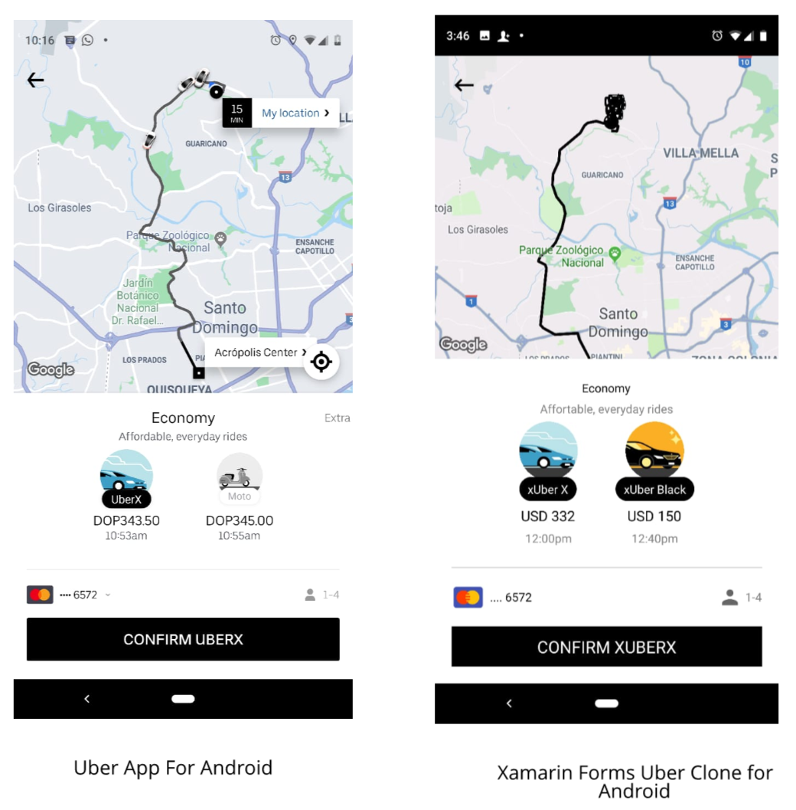
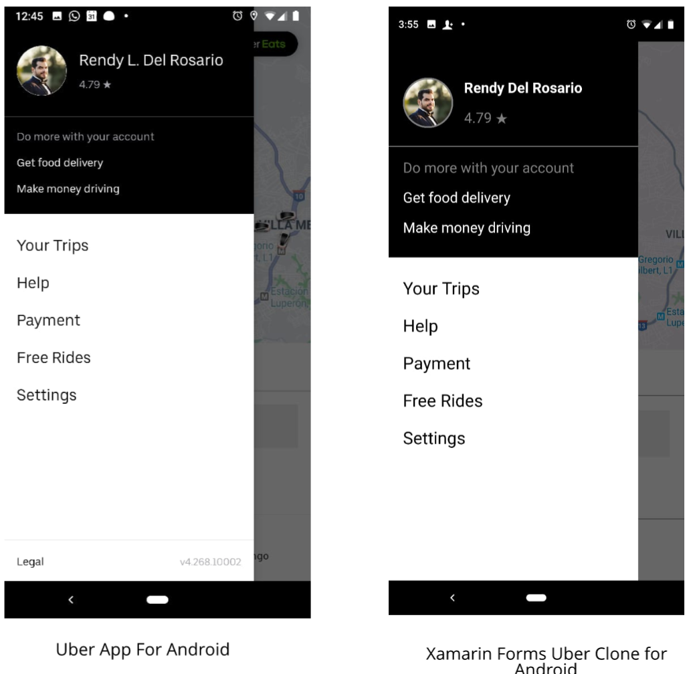

# xUber
Uber Clone using Xamarin Forms

Blog post: [Introducing xUber  - Uber Clone using Xamarin Forms](https://www.xamboy.com/2019/07/03/introducing-xuber-uber-clone-using-xamarin-forms)

To test replace the **GoogleMapsApiKey** to use your own Google Maps Api Key in Constants.cs 

## Screenshots

## Tools used
- **Xamarin.Forms.GoogleMaps** - Map library for Xamarin.Forms using Google maps API  https://github.com/amay077/Xamarin.Forms.GoogleMaps

- **PropertyChanged.Fody** - Handles property changed events.      
https://github.com/Fody/PropertyChanged

- **Xamarin.Essentials** - Essential cross platform APIs for your mobile apps.     
https://github.com/xamarin/Essentials

- **CardsView** - CardsView | CarouselView | CoverflowView | CubeView for Xamarin.Forms.
https://github.com/AndreiMisiukevich/CardView

- **Acr.UserDialogs** - A cross platform library that allows you to call for standard user dialogs. https://github.com/aritchie/userdialogs

- **Xam.Plugins.Forms.ImageCircle** - Circle Images for your Xamarin.Forms Applications. https://github.com/jamesmontemagno/ImageCirclePlugin

- **Icon8 Icons** - Free design resources sand software.       
https://icons8.com/
